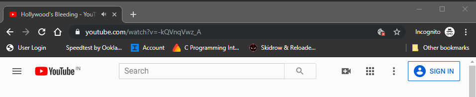
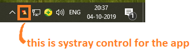

# Youtube x VLC x Pyhton ☑️

## What It Does❓
#### Plays YouTube videos in your VLC with just one command

## Tools I Used🛠
###  Base Language- Python
#### Python Libraries Used
- **[Clipboard]**
- **[Win10toast]**
- **[Win32gui]**
- **[infi.systray]**
  
## How To use🖱
- Clone this repo and extract files to your desired location.
- Open **Youtube x VLC x Pyhton --> YT_VLC.exe**.
- If everything runs good this will show up.\

- Open your browser and redirect to YouTube page whose video you want to play in VLC. 
- Use just need to add **-vlc** to your YouTube URL and copy it and your done ✔️. 

- It automatically open VLC and plays your video
- To close the script use the system tray icon \

## How It Works🤔
- My scripts looks for the clipboard actions.
- After checking certain **conditons** such as
    - Current active window?
    - Incorrect URL?
    - Youtube Streamable Link?
    - Explicit input of `-vlc`?
- Script then executes a command line tool provided by VLC which allows VLC  to stream videos . 
- This eliminates the usage of external **api** or **ctypes** to communicate between diffrent programs.

## Why Would One Use It 😬

The whole purpose of making this script is because some videos over there in youtube has very low volume especially olden educational videos like before 2008 so one gratefully VLC allows this by using streamable link and playing that video in its interface and maximizing volume upto 200%

I hated this process of copying 
- video url --> opening VLC --> open streamable file --> paste url and 
then watch video\

So here it is , a complete automated script that does most of you manual work with just a couple of keystrokes 👌

## How To Contribute🤝 
- The code file is named as `code.py` changes can be made there.
- Yes,it is open source you can clone and change code to your need.
- for any clarification on code or want to contribute contact vashish888@gmail.com or Dm me on [Instagram].

## Know Problems❌
- Currently Support only **Windows 10 64Bit**

[Clipboard]: <https://pypi.org/project/clipboard/>
[Win10toast]: <https:/github.comjithurjacobWindows-10-Toast-Notifications>
[Win32gui]:<https://pypi.org/project/win32gui/>
[infi.systray]: <https://github.com/Infinidat/infi.systray>
[Instagram]: <https://www.instagram.com/iamash1sh/>

